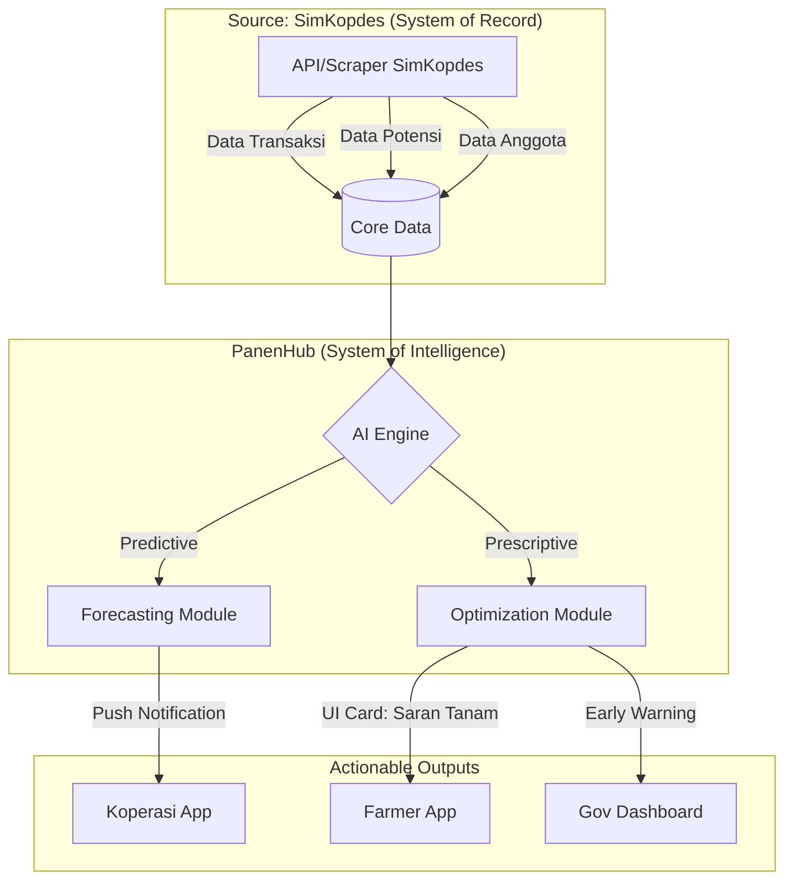

# Rencana Pemanfaatan & Integrasi Data SimKopdes Cilangkap
**Transformasi Koperasi Kelurahan Merah Putih (KKMP) menjadi System of Intelligence (SoI)**

Dokumen ini merincikan bagaimana data mentah dari [SimKopdes Cilangkap](https://simkopdes.go.id/cilangkap-kecamatan-tapos-kota-depok) diintegrasikan ke dalam ekosistem PanenHub untuk menciptakan aksi nyata (*actionable actions*).

---

## 1. Profil Aset Data (Inventory Analysis)

Berdasarkan data SimKopdes per 5 April 2026, KKMP memiliki aset strategis sbb:

| Kategori | Aset Utama | Status / Nilai |
| :--- | :--- | :--- |
| **Potensi Desa** | Wisata Kuliner, Danau/Situ, Holtikultura | Total Potensi: Rp 510 Juta/Thn |
| **Demografi** | 59.703 Penduduk (99.8% belum anggota) | Penetrasi Anggota: 0.204% |
| **Produk** | Beras SPHP | Stok: 293 bag (5kg) |
| **Struktur** | 11 Pengurus, 5 Pengawas | Dipimpin oleh Taufik Julpikar |

---

## 2. Intelligence Mapping: Dari Data ke Aksi

PanenHub akan mengolah data di atas melalui 3 lapisan kecerdasan:

### A. Predictive AI (Antisipasi Masa Depan)
*   **Inventory Depletion Predictor:** Berdasarkan stok Beras SPHP (293 bag), AI memprediksi tanggal "Stock-Out" berdasarkan tren penjualan mingguan.
    *   *Action:* Notifikasi otomatis ke pengurus 3 hari sebelum stok habis.
*   **Culinary Traffic Forecast:** Mengintegrasikan data "Wisata Kuliner Situ Cilangkap" dengan cuaca (BMKG). 
    *   *Action:* Prediksi lonjakan pengunjung di akhir pekan cerah untuk optimalisasi stok bahan baku.

### B. Prescriptive AI (Optimalisasi Strategis)
*   **Member Conversion Engine:** Menganalisis gap antara 59k penduduk vs 122 anggota.
    *   *Action:* Rekomendasi segmentasi promosi (misal: penawaran khusus sembako untuk warga non-anggota di RW 09 & 14 yang baru disosialisasi).
*   **Value Chain Synergy:** Menggabungkan "Potensi Perikanan/Kolam (2.0 ton)" dengan "Unit Kuliner Situ Cilangkap".
    *   *Action:* Rekomendasi menu berbasis hasil panen lokal untuk meningkatkan margin unit usaha.

---

## 3. Actionable Workflows (Tombol Eksekusi)

Dalam **Koperasi Intelligence App**, data SimKopdes akan muncul sebagai *Action Cards*:

1.  **[Tombol: Pesan Sekarang]** — Muncul saat stok Beras SPHP diprediksi habis < 3 hari. Terhubung langsung ke Distributor/Bulog.
2.  **[Tombol: Luncurkan Kempen Anggota]** — Ditargetkan ke wilayah dengan penetrasi terendah (< 0.1%) berdasarkan heatmap penduduk.
3.  **[Tombol: Optimasi Menu]** — Menghubungkan unit Holtikultura dengan Unit Kuliner untuk penyerapan hasil tani anggota secara internal.

---

## 4. Arsitektur Integrasi Teknis

---

## 5. Implementasi Bertahap (Roadmap)

### Fase 1: Data Bridge (Minggu 1)
- Pembuatan API Connector atau script sinkronisasi otomatis dari `simkopdes.go.id`.
- Mapping CSV/JSON untuk "Potensi Desa" ke dalam database PanenHub.

### Fase 2: Intelligence Layer (Minggu 2-3)
- Training model AI dengan data historis KKMP Cilangkap.
- Implementasi *Early Warning System* untuk stok sembako.

### Fase 3: UI/UX Actionable Dashboard (Minggu 4)
- Penambahan modul "Cilangkap Intelligence" di `desktop-v2.html`.
- Aktivasi tombol eksekusi yang terhubung ke alur kerja pengurus.

---

> [!TIP]
> **Quick Win:** Gunakan data sisa stok Beras SPHP (293 bags) untuk membuat modul "Live Inventory Intelligence" pertama di dashboard Cilangkap.

> [!IMPORTANT]
> Keanggotaan yang hanya 0.2% adalah *low-hanging fruit*. PanenHub harus memberikan insentif digital (misal: tracking poin belanja anggota) yang datanya ditarik dari SimKopdes untuk mendorong warga Cilangkap bergabung.
